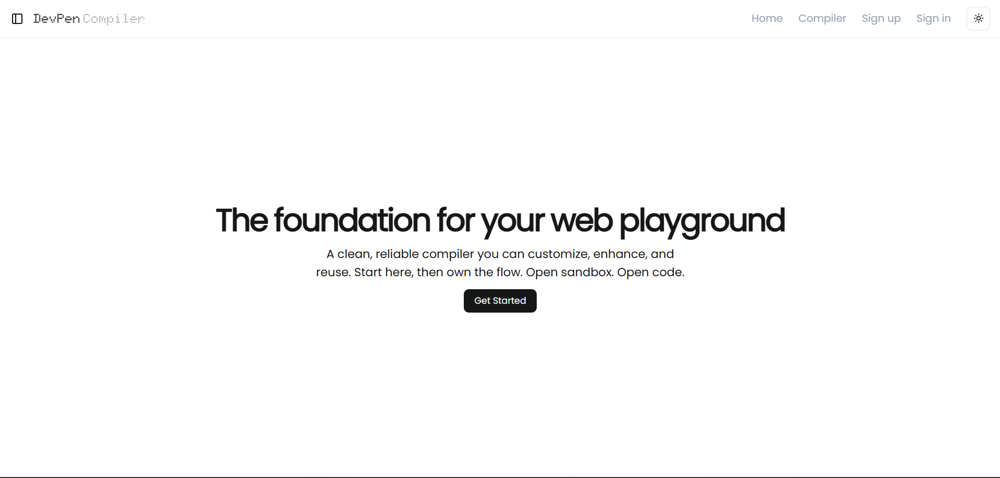
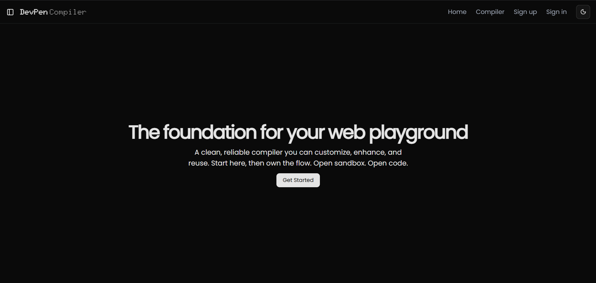
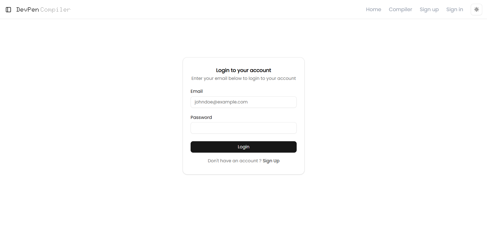
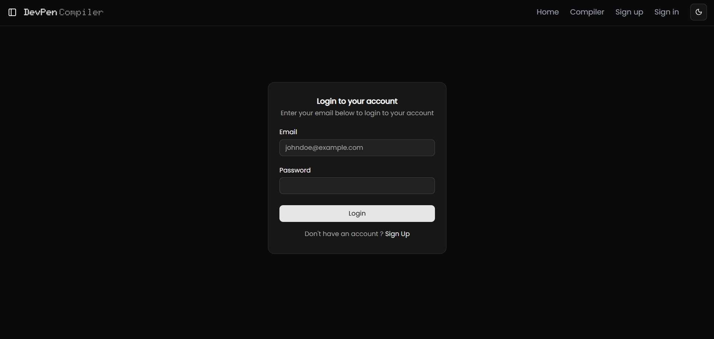
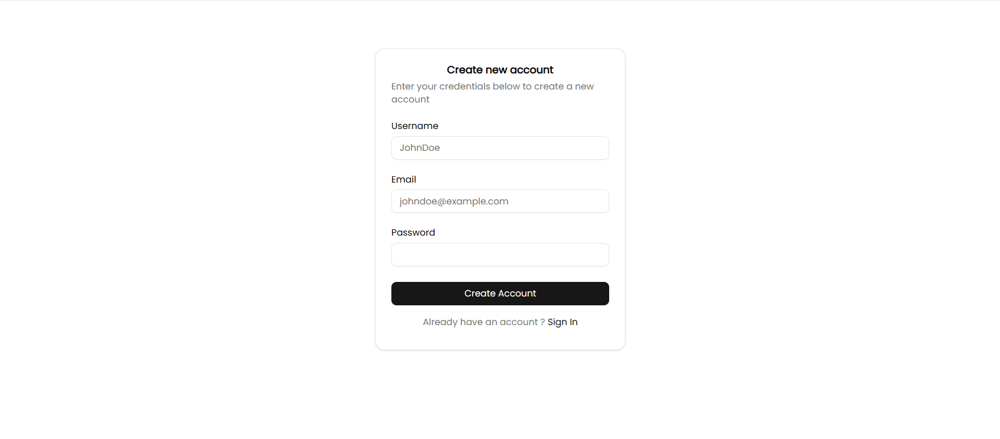
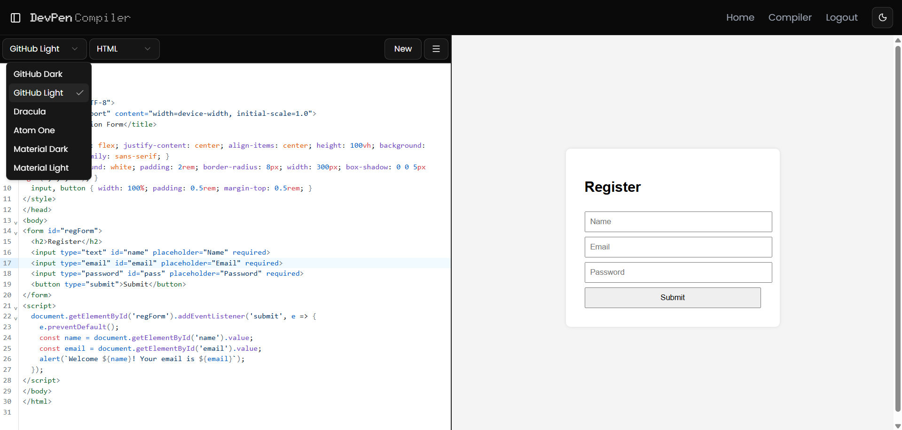
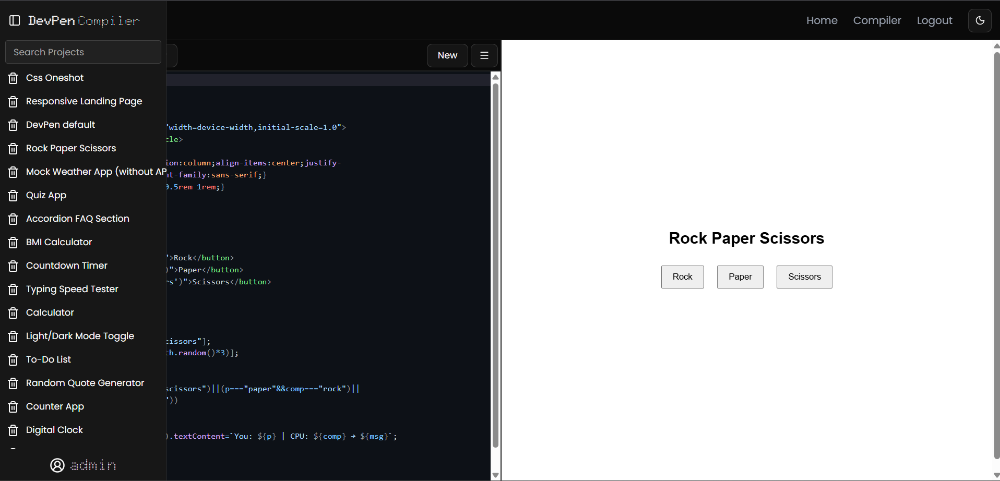
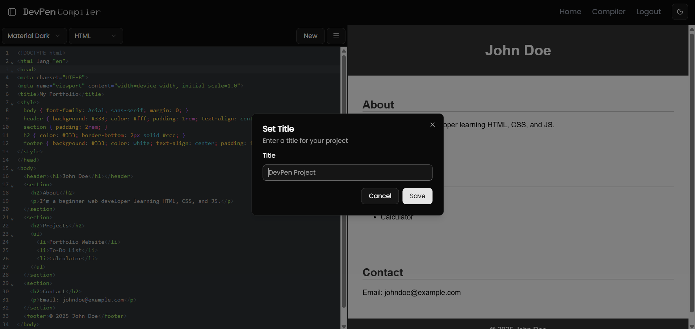
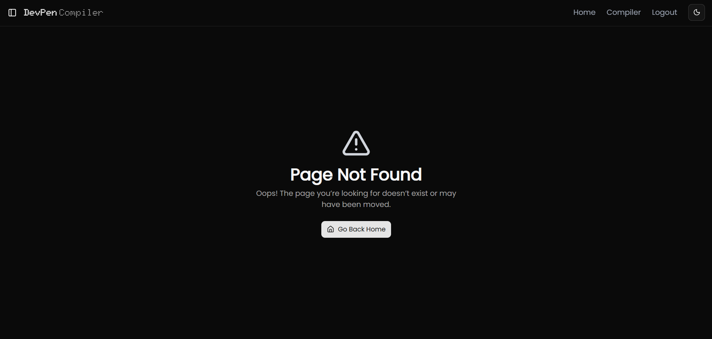

# 🧩 Devpen Compiler


---

## 📌 Overview

**Devpen Compiler** is a full-stack, CodePen-inspired web application built using the **MERN stack**.  
It allows users to **write, run, and save HTML, CSS, and JavaScript code in real time** directly from their browser.

The application provides a **secure, authenticated environment** where users can manage personal code snippets and instantly preview results using a **live iframe-based sandbox**.

---

## ✨ Features

### 💻 Live Code Editor
- Write **HTML, CSS, and JavaScript** with syntax highlighting
- Powered by **CodeMirror**
- Real-time output preview using an **iframe sandbox**

### 🔐 Authentication & Security
- Email & password-based authentication
- JWT-based authentication stored in **HTTP-only cookies**
- Password hashing using **bcrypt**
- Input validation with **Zod**
- Custom middleware for route protection

### 💾 Project Management
- Create and save code projects
- Edit and reopen saved projects anytime
- Persistent storage using **MongoDB**

### 🧠 Protected Routes
- Only authenticated users can:
  - Save projects
  - View personal projects
  - Edit existing projects

### 🎨 Modern UI
- Fully responsive design
- Built with **Tailwind CSS** and **Shadcn UI**
- Light & Dark theme support

---

## 🛠 Tech Stack

### Frontend
- React 19
- TypeScript
- Vite
- Tailwind CSS
- Shadcn UI
- Redux + useState
- CodeMirror (code editor)
- iframe sandbox (live preview)

### Backend
- Node.js
- TypeScript
- Express.js
- REST API architecture
- JWT authentication (HTTP-only cookies)
- bcrypt (password hashing)
- Zod (validation)
- Custom authentication middleware

### Database
- MongoDB
- Mongoose ODM

---

## 📂 Project Structure

```
DevPen/
│
├── client/
├── server/
├── screenshots/
├── README.md
```

---

## 📸 Screenshots

### 🏠 Landing Page (Light Theme)


### 🌙 Landing Page (Dark Theme)


### 🔐 Sign In Page (Light)


### 🌙 Sign In Page (Dark)


### 📝 Sign Up Page (Light)


### 🌙 Sign Up Page (Dark)


### 💻 Compiler – Multi Theme Support


### 📁 Saved Projects Section


### 🆕 New Project Section


### ❌ 404 – Not Found Page


---

## 🔐 Environment Variables

### Frontend (`client/.env`)
```env
VITE_REACT_APP_BACKEND_BASEURL=your_backend_url
```

### Backend (`server/.env`)
```env
MONGO_URL=your_mongodb_connection_string
CLIENT_URL=your_frontend_url
JWT_SECRET=your_jwt_secret
```

---

## 🚀 Local Setup

```bash
git clone https://github.com/Piyush-mit/DevPen-Project.git
cd DevPen 
```

---

## 📄 License

MIT License
